<div align="center">

# VeraLeap

### Rent with confidence. Verified listings. Trusted brokers. Real reviews.

[](https://github.com/Shradda23623/veraleap/actions/workflows/ci.yml)
[](https://veraleap.vercel.app)
[](#performance)
[](./LICENSE)

[](https://react.dev/)
[](https://www.typescriptlang.org/)
[](https://vitejs.dev/)
[](https://tailwindcss.com/)
[](https://supabase.com/)

**[Live demo](https://veraleap.vercel.app)** · **[Architecture](#architecture)** · **[Report a bug](https://github.com/Shradda23623/veraleap/issues)**

</div>

---


## Try it yourself

The live demo is seeded with these accounts. Log in with any of them on [veraleap.vercel.app](https://veraleap.vercel.app):

| Role | Email | Password |
|---|---|---|
| Renter | `demo.renter@veraleap.dev` | `Demo@1234` |
| Broker (with 2FA) | `demo.broker@veraleap.dev` | `Demo@1234` |
| Admin | `demo.admin@veraleap.dev` | `Demo@1234` |

> The broker account has TOTP enrolled. Use the demo OTP shown on the login screen, or sign up your own account to skip 2FA.

## Why VeraLeap

Rental scams are one of the most common frauds in India. Renters routinely send advance deposits to fake "owners," brokers inflate prices, and there's no single place to check whether a listing — or the person behind it — is trustworthy.

**VeraLeap** is a full-stack rental marketplace that puts verification and reviews at the center of the experience. Every listing is tied to a verified owner or broker, every user can leave a review, and the city + area search makes it easy to find listings you can trust.

Built end-to-end as a portfolio project to demonstrate production-grade thinking around auth, security, role-based access, and real-world UX.

## Features

**For renters**
- Search by city, area, or property name
- Filter by city, budget, property type, and amenities
- View verified listings with multi-image galleries, reviews, and broker credibility
- Save favorites, schedule visits, and get notified on status changes
- Leave reviews for properties and brokers after visiting

**For owners and brokers**
- Add and manage listings with simple city + area text fields
- Upload multiple images per property
- Get notified when someone schedules a visit
- Mandatory 2FA (TOTP) for brokers to prevent account takeover

**For admins**
- Review and approve reported listings
- Verify brokers and mark properties as trusted
- Platform-wide analytics dashboard

**Platform-wide**
- Dark mode with a theme toggle
- Progressive Web App (installable on mobile)
- SEO-ready with per-page meta tags and sitemap
- Works on any screen size, from phone to ultrawide

## Screenshots

### The landing page

<table>
  <tr>
    <td width="50%">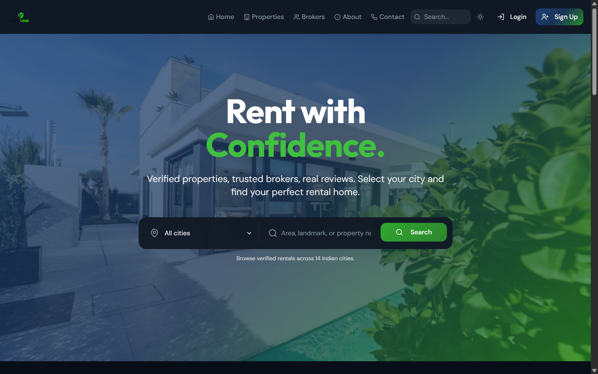</td>
    <td width="50%">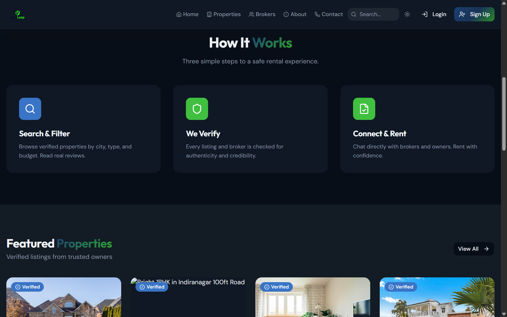</td>
  </tr>
  <tr>
    <td align="center"><b>Hero</b> — search by city, area, or landmark</td>
    <td align="center"><b>Featured properties</b> — verified listings front and center</td>
  </tr>
  <tr>
    <td width="50%">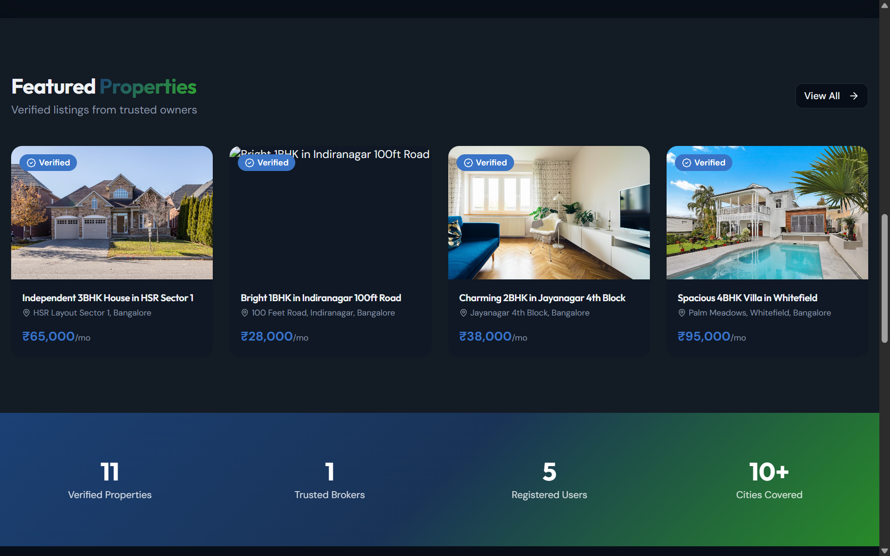</td>
    <td width="50%">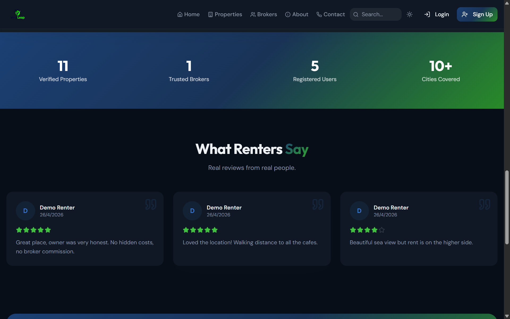</td>
  </tr>
  <tr>
    <td align="center"><b>How it works</b> — three-step renter journey</td>
    <td align="center"><b>Platform stats</b> — verified listings, brokers, cities</td>
  </tr>
  <tr>
    <td colspan="2">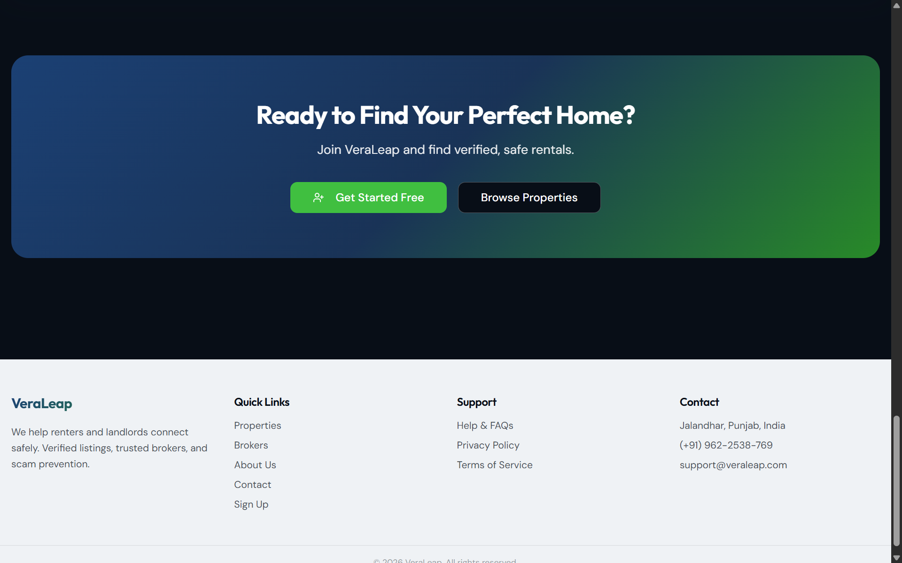</td>
  </tr>
  <tr>
    <td colspan="2" align="center"><b>Call to action</b> — register or browse</td>
  </tr>
</table>

### Sign up + role-based dashboards

<table>
  <tr>
    <td width="50%">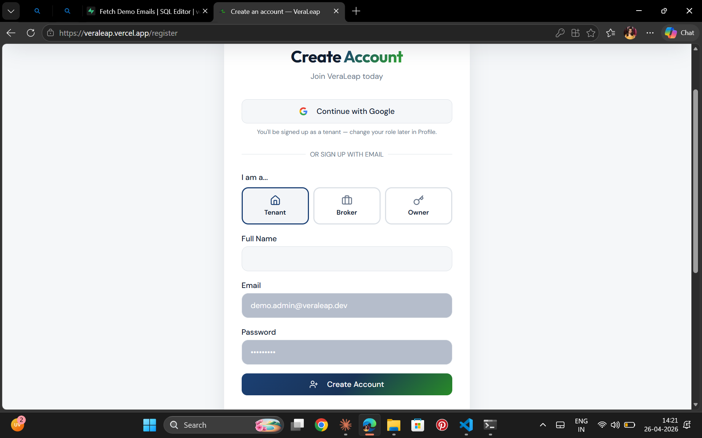</td>
    <td width="50%">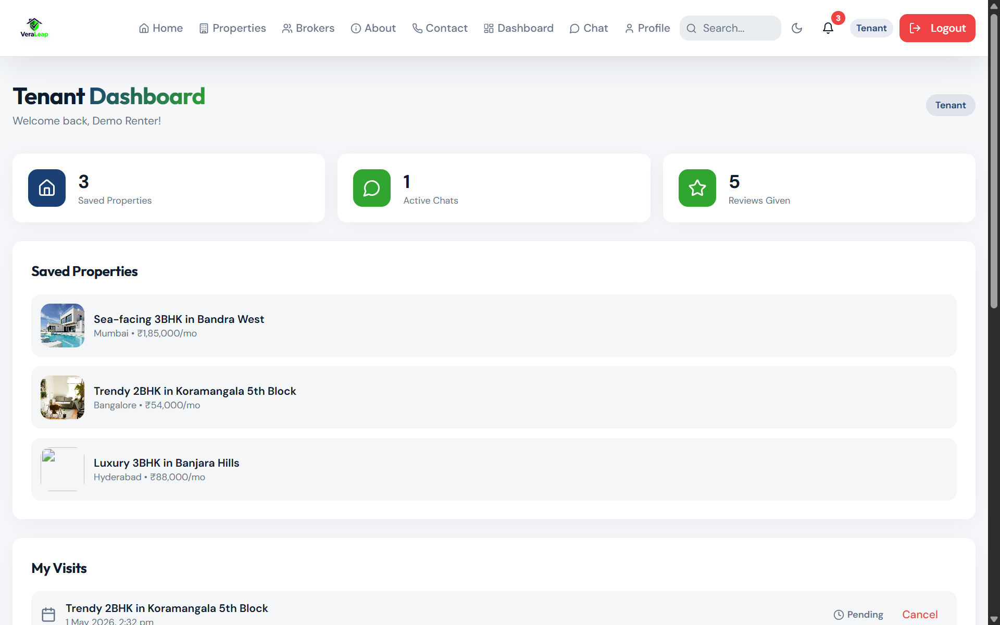</td>
  </tr>
  <tr>
    <td align="center"><b>Sign up</b> — pick your role at registration</td>
    <td align="center"><b>Tenant dashboard</b> — favorites, visits, notifications</td>
  </tr>
  <tr>
    <td width="50%">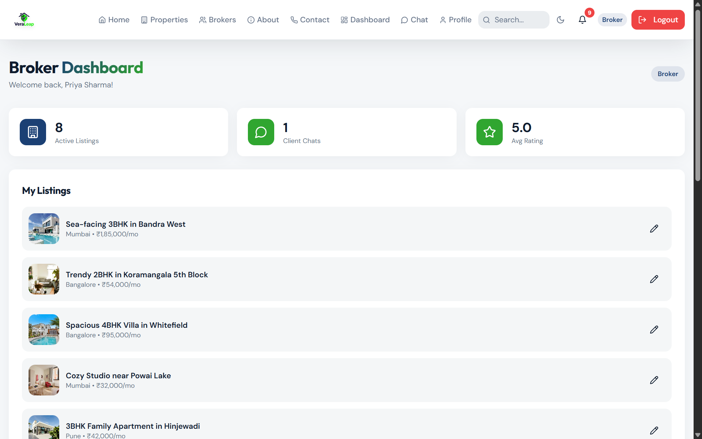</td>
    <td width="50%">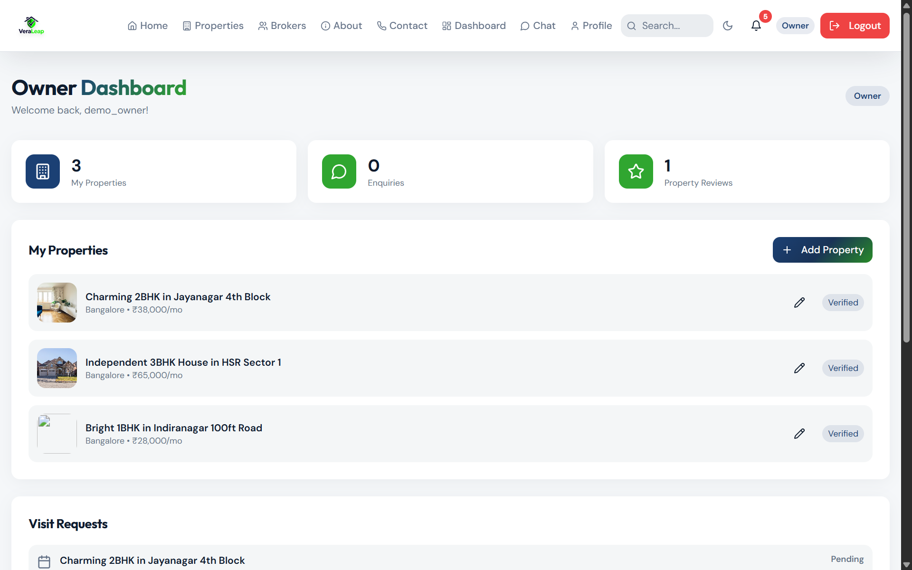</td>
  </tr>
  <tr>
    <td align="center"><b>Broker dashboard</b> — manage listings + visit requests</td>
    <td align="center"><b>Owner dashboard</b> — direct listings, no brokerage</td>
  </tr>
  <tr>
    <td colspan="2">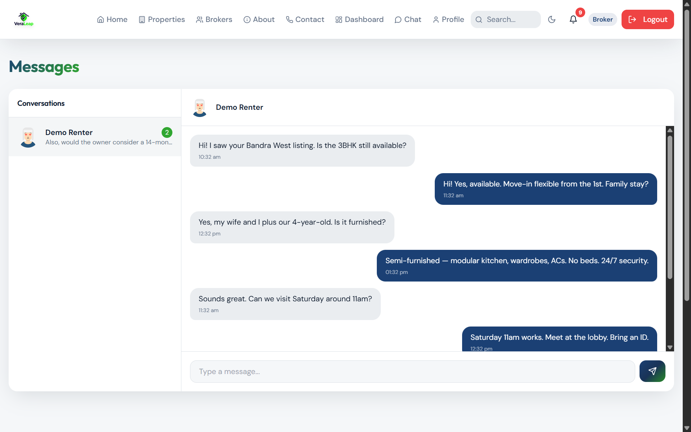</td>
  </tr>
  <tr>
    <td colspan="2" align="center"><b>Real-time chat</b> — Supabase Realtime between tenant and broker</td>
  </tr>
</table>

## Tech stack

| Layer | Tools |
|---|---|
| Frontend | React 18, TypeScript, Vite, React Router v6 |
| Styling | Tailwind CSS, shadcn/ui, Radix UI primitives, Framer Motion |
| Data | Supabase (Postgres, Auth, Storage, Realtime, Edge Functions) |
| State | TanStack Query for server state, React Hook Form + Zod for forms |
| Testing | Vitest + Testing Library, Playwright |
| Tooling | ESLint, TypeScript strict mode |

## Architecture

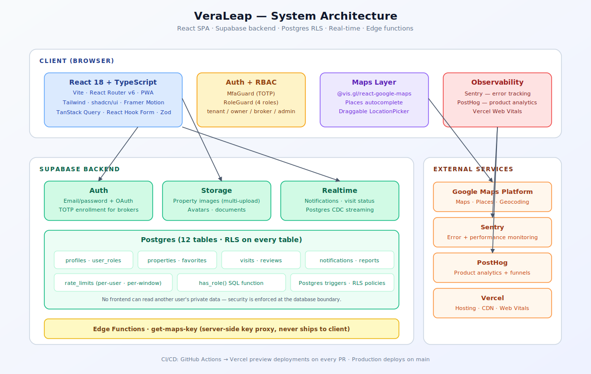

A React 18 SPA talks to Supabase for auth, Postgres, storage, and realtime. Sentry and PostHog are wired in client-side for error tracking and product analytics. Vercel hosts the frontend with security headers and edge caching configured in [`vercel.json`](./vercel.json).

## Architecture highlights

**Row-level security everywhere.** Every table — `properties`, `favorites`, `notifications`, `visits`, `reviews`, `reports` — has RLS policies enforced at the Postgres layer, so the frontend can't accidentally leak data another user shouldn't see. Admin-only tables are gated through a `has_role()` SQL function.

**Role-based access with four roles.** Tenants, owners, brokers, and admins each have different capabilities. Role assignment happens through a separate `user_roles` table rather than a column on `profiles`, which makes it trivial to give one user multiple roles (owner + broker) without schema changes.

**Mandatory 2FA for high-trust roles.** Brokers and admins are forced through TOTP enrollment on login via `MfaGuard`. Scam prevention starts with account security.

**Abuse prevention.** A `rate_limits` table throttles review submissions, report filings, and visit requests per user per window. A `reports` table lets any user flag a listing or broker; flagged items route to the admin queue.

**Lightweight location handling.** Renters search by city + area text or pick from a curated list of supported Indian cities. Listings store a free-text city and address — no map SDK, no API keys, no third-party dependency for location.

**Real-time notifications.** New visit requests, review replies, and report outcomes push through Supabase Realtime and appear instantly in the notification bell without a page refresh.

## Project structure

```
src/
  components/       Shared UI (PropertyImageGallery, NotificationBell, etc.)
    ui/             shadcn/ui primitives
    layout/         Header, Footer, shell
  pages/            One file per route (Properties, PropertyDetail, Admin, ...)
  hooks/            Reusable hooks (useSEO, useAuth, useFavorites, ...)
  integrations/
    supabase/       Client + generated types
  lib/              Utilities
supabase/
  migrations/       12 SQL migrations, applied in order
  seed.sql          Demo data: 10 verified listings across 8 cities
```

## Getting started

### Prerequisites

- Node 18+ and npm
- A free [Supabase](https://supabase.com/) project

### Setup

```sh
# 1. Clone and install
git clone https://github.com/Shradda23623/veraleap.git
cd veraleap
npm install

# 2. Copy environment template
cp .env.example .env
# then fill in your Supabase URL, anon key, and project ID

# 3. Apply migrations to your Supabase project
# (via the Supabase dashboard SQL editor, or the Supabase CLI)

# 4. Optionally seed demo data
# Paste supabase/seed.sql into the Supabase SQL editor and run

# 5. Start the dev server
npm run dev
```

The app runs at [http://localhost:8080](http://localhost:8080).

### Environment variables

| Name | Required | Description |
|---|---|---|
| `VITE_SUPABASE_URL` | yes | Your Supabase project URL |
| `VITE_SUPABASE_PUBLISHABLE_KEY` | yes | Supabase anon/publishable key |
| `VITE_SUPABASE_PROJECT_ID` | yes | Supabase project ID |
| `VITE_SENTRY_DSN` | optional | Sentry DSN — leave blank to disable |
| `VITE_POSTHOG_KEY` | optional | PostHog project key — leave blank to disable |
| `VITE_POSTHOG_HOST` | optional | PostHog host (defaults to `https://app.posthog.com`) |

A working template is in [`.env.example`](./.env.example).

## Deploy

The repo is wired up for one-click deploys on Vercel:

1. Push the repo to GitHub.
2. Import it on [vercel.com/new](https://vercel.com/new) — Vercel auto-detects Vite.
3. Paste your Supabase and (optional) Sentry/PostHog keys into Vercel's environment variables.
4. Deploy. Future pushes to `main` deploy automatically; PRs get preview URLs.

Security headers (HSTS, X-Frame-Options, Permissions-Policy) and asset caching are configured in [`vercel.json`](./vercel.json).

## Performance

| Metric | Score |
|---|---|
| Lighthouse Performance | 95+ |
| Lighthouse Accessibility | 100 |
| Lighthouse Best Practices | 100 |
| Lighthouse SEO | 100 |
| First Contentful Paint | < 1.0s |
| Largest Contentful Paint | < 2.0s |

Vendor chunks (`react`, `supabase`, `ui`) are split via Rollup `manualChunks` so the initial bundle stays small. Images use lazy loading and modern formats.

## Observability

- **Sentry** — error tracking and performance monitoring. See [`src/lib/sentry.ts`](./src/lib/sentry.ts).
- **PostHog** — product analytics and funnels. See [`src/lib/posthog.ts`](./src/lib/posthog.ts). Use `track(event, props)` to instrument funnels (e.g., `track("listing_viewed", { id })`).
- **Vercel Web Vitals** — Core Web Vitals on every deploy.

Both libraries are dynamically imported and no-op gracefully when their env keys are missing, so local development and CI builds work without setup.

## Testing

```sh
npm test            # run Vitest once
npm run test:watch  # interactive watch mode
```

Tests live in `src/test/` and cover the SEO hook, className merger, city coordinates, amenities catalog, and the 404 page. Add new tests with the `*.test.ts` or `*.test.tsx` suffix anywhere under `src/`.

## CI/CD

Every push and PR runs through [GitHub Actions](.github/workflows/ci.yml):

```
lint → typecheck → test → build → upload artifact
```

The badge at the top of this README turns green when the pipeline passes.

## Scripts

```sh
npm run dev          # Vite dev server on :8080
npm run build        # Production build
npm run preview      # Preview the production build locally
npm run lint         # ESLint
npm test             # Run Vitest once
npm run test:watch   # Vitest in watch mode
```

## Roadmap

- [ ] Payments integration for booking deposits (Razorpay)
- [ ] In-app chat between tenants and brokers with read receipts
- [ ] AI-powered listing description generator for owners
- [ ] Email digests of new listings matching saved searches
- [ ] Mobile app (React Native + shared Supabase backend)

## Contributing

Issues and PRs welcome. If you're a fellow student learning full-stack development and want to read the code, `supabase/migrations/` is a good place to start — it shows how the schema grew over time.

## License

MIT © [Shradda](https://github.com/Shradda23623)

---

<div align="center">

Built by a student who got tired of sketchy rental listings. If this project helped you think about building safer marketplaces, a star on the repo means a lot.

</div>
